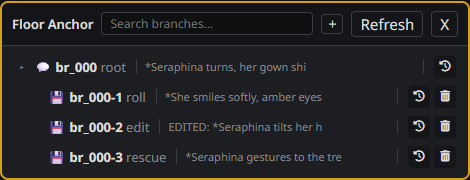
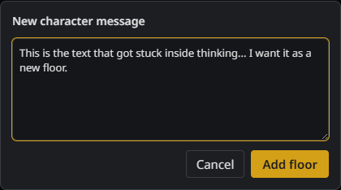

# ST Floor Anchor

> 给 SillyTavern / TauriTavern 的楼层快照与回退面板

在重roll、删除或编辑之前，插件会自动给当前聊天存一份快照；之后想反悔，随时能在面板里一键切回任意历史版本。快照就是普通的聊天文件（文件名带 `[FA]` 标记），并且会自动从 ST 自带的聊天列表里隐藏，不会把你的聊天列表弄得乱糟糟。

- 语言：[English](README.en.md)
- 版本：v0.1.7（SillyTavern 1.18+，兼容 TauriTavern 移动端）
- 更新日志：[CHANGELOG.md](CHANGELOG.md)

## 截图





## 它能做什么

- **动手前先备份**：每次重roll、删除或编辑，都会自动拍下当前聊天；内容比对过去重，API 断连时误点重roll也不会留下多余备份。
- **分支树一目了然**：编号按层级递归（`br_000` → `br_000-1` → `br_000-1-1`），回退路径一眼就能看懂。
- **一键回退**：点 Switch 图标切回任意历史快照——回退本质上就是切换聊天。
- **快照随手清理**：Prune 图标删除不要的快照，编号会自动重排；两步确认，防止手滑误删。
- **每个聊天互不干扰**：每个聊天都有自己独立的一棵撤销树，切换聊天或角色卡，面板会自动跟着切换。
- **正文预览**：每个分支显示最后一条正文，太长会自动滚动；预设往正文里塞的状态栏、思维链之类的标签，可以在设置里过滤掉。
- **拯救卡住的回复**：当角色的回复卡在 thinking 里、迟迟出不了正文时，楼层会处于不可编辑状态——这时可以直接新建一个角色消息楼层，把内容放进去（会自动生成 rescue 快照）。

## 安装

### SillyTavern（桌面端）

1. 打开顶部菜单：**Extensions → Install extension**。
2. 粘贴仓库地址：

   ```
   https://github.com/Icey0111/st-floor-anchor
   ```

3. 装完刷新页面即可。

也可以用链接直接安装 zip：

```
https://github.com/Icey0111/st-floor-anchor/archive/refs/heads/main.zip
```

### TauriTavern（移动端）

在扩展安装界面粘贴同一个仓库地址就行。移动端已经做好适配：面板居中、可以拖动、只占半屏，还会自动避开安全区和输入法。

## 怎么用

1. 在任意消息的操作按钮里（铅笔和“…”之间）找到小图标，点击打开 Floor Anchor 面板。
2. 之后每次重roll、删除或编辑，插件都会自动生成快照，面板里会多出对应的分支。
3. 点 **Switch**（回退图标）切回某个历史快照；点 **Prune**（垃圾桶图标）删掉不想要的快照。
4. 想新建角色楼层？点面板右上角的 **+**，把卡在 thinking 里的正文粘贴进去，点 Add floor（或按 Ctrl+Enter）。
5. 设置入口在扩展面板的 Floor Anchor 抽屉里：可以调分支预览长度，也可以配置要从预览里过滤掉的 XML 标签（比如某些预设的状态栏、思维链标签）。

## 分支编号说明

| 编号 | 含义 |
|------|------|
| `br_000` | 当前聊天的根 |
| `br_000-1` / `br_000-2` | 根下面的历史快照 |
| `br_000-1-1` | 从快照 `br_000-1` 继续延伸出来的递归分支 |

每个聊天都从自己的 `br_000` 开始编号；切换聊天后，面板只会显示当前这棵聊天自己的树。

## 常见问题

**快照存在哪里？**
就存在这个角色的聊天目录里，是普通的聊天文件，文件名带 `[FA]` 标记；ST 自带的聊天列表会自动把它们藏起来，所以不会越攒越乱。

**为什么根节点没有 Prune 按钮？**
根节点就是你现在正在聊的这份聊天，删了等于删掉整个对话，所以 Prune 只对快照开放。

**群聊支持吗？**
暂时不支持（v1 只做单人聊天），群聊里不会触发快照。

**怎么卸载、顺便清掉快照？**
先在 ST 的扩展管理里移除插件，再进到对应角色的聊天目录，把文件名带 `[FA]` 的 `.jsonl` 文件删掉就行。

**预览怎么显示的是思维链，不是正文？**
预览只会取消息正文（`mes`），思维链永远不会拿来当预览。如果某些预设把正文包在自定义标签里，把标签名填进设置里的过滤列表就行。

## 兼容性

- SillyTavern 1.18+（桌面端）
- TauriTavern（移动端，含安全区 / 输入法适配）
- 纯前端扩展，不需要 Node 后端

## 给开发者

- 设计文档：`dev_docs/`
- 单元测试：`npm test`
- 浏览器回归脚本：`.regression/`（本地用，不入库）

## License

本项目采用 [MIT License](LICENSE)。

有问题或者建议，欢迎到 [GitHub Issues](https://github.com/Icey0111/st-floor-anchor/issues) 反馈。
