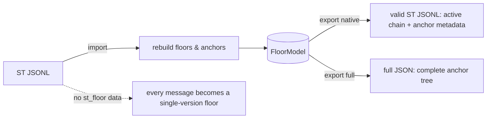
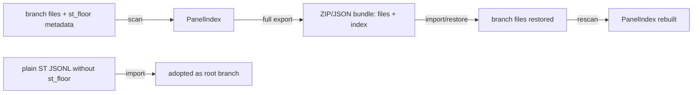
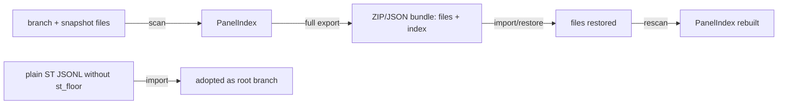

# Architecture

<!-- Versioned & append-only: never edit past versions; newest is last. -->


<!-- VERSION 1 -->
## v1 - baseline (pre-versioning)

## Overview

The extension runs entirely in the SillyTavern browser context. A pure
JavaScript data layer (`model/`, `store/`) owns the floor/anchor structure and
maps it onto the native JSONL chat representation using only sanctioned
extension surfaces:

- chat-level metadata: `chat_metadata.st_floor`
- message-level metadata: `message.extra.st_floor`
- native hidden flag on non-active anchors (removes them from display and from
  the prompt context)

No server-side code and no modification to ST core are required. This keeps
installation a plain UI-extension install and guarantees native
import/export compatibility by construction.

## Module Boundaries

| Module | Responsibility | Depends on | ST surface used |
|--------|----------------|------------|-----------------|
| `model/` | Floor/anchor/branch entities, invariants, pure operations (roll, delete, edit, rescue, rollback) | nothing | none (pure JS) |
| `store/` | Serialize/deserialize the model onto the ST chat array, `chat_metadata`, `extra`, `is_hidden`; integrity checks | model | `chat`, `chat_metadata`, message objects |
| `actions/` | Hook ST events; convert destructive native operations into anchor operations; run thinking rescue | model, store | event bus, generation events, message actions |
| `ui/` | Hide non-active anchors, floor navigation panel, per-floor menus, rescue/editor dialogs | store, actions | DOM, `message_rendered`, `message_edited` |
| `io/` | Native-compatible export, full-format export, import rebuild, round-trip validation | model, store | `chat_metadata`, message schema |

## Key Flows

### Roll (swipe) at floor N

```mermaid
sequenceDiagram
    participant U as User
    participant A as actions
    participant M as model
    participant S as store
    participant R as ui
    U->>A: roll on floor N
    A->>M: capture old message + old tail pointer
    M->>M: create anchor fNv2 (kind=roll, parent=fNv1, oldContinuation=tail)
    A->>S: persist (extra.st_floor + is_hidden swap)
    S-->>R: re-render active chain
    R-->>U: floor N shows v2; v1 hidden but retained
```

### Delete at floor N

```mermaid
sequenceDiagram
    participant U as User
    participant A as actions
    participant M as model
    participant S as store
    U->>A: delete message(s) at floor N
    A->>M: create tombstone anchor (kind=delete, keeps content + oldContinuation)
    M->>M: set floor N inactive; active pointer -> previous floor
    A->>S: persist tombstone as hidden message
    S-->>U: chat continues from floor N-1; delete is reversible
```

### Thinking rescue (truncated reasoning)

```mermaid
sequenceDiagram
    participant G as ST generation
    participant A as actions
    participant U as User
    participant M as model
    G->>A: GENERATION_ABORTED / empty body with extra.reasoning
    A->>U: offer "create char floor from thinking"
    U->>A: confirm (optional edit)
    A->>M: create floor N+1 anchor (kind=rescue, source = truncated message)
    M->>M: mark truncated message as tombstone anchor
    A->>U: new editable char floor appears; content no longer locked
```

### Import / export



## Event Surface

| ST event / hook | Purpose |
|-----------------|---------|
| `chat_loaded` | Rebuild `FloorModel` from `chat_metadata.st_floor`; fall back to single-version floors |
| `message_rendered` | Attach floor badges and per-floor actions; ensure non-active anchors stay hidden |
| swipe events | Convert to roll anchors |
| `message_edited` | Convert in-place edits to edit anchors (G2) |
| `message_deleted` | Convert to tombstone anchors |
| `GENERATION_ABORTED` / `GENERATION_STOPPED` | Detect truncated reasoning; offer rescue |
| `/floor` slash commands | Floor navigation, rollback, branch list (optional) |


<!-- VERSION 2 -->
## v2 - 2026-08-02 02:51:51 - switch to ST-native branch-file storage; rollback = chat switch

## Overview

The extension runs entirely in the SillyTavern browser context and reuses
ST's own chat-branching capability as the storage primitive:

- every roll / delete / edit creates a NEW ST chat file (a branch session)
  via the native branch/checkpoint mechanism, then switches the active chat;
- the source file is never modified, so "the state before the operation" IS
  the source branch itself (no hidden anchor copies, no tombstone messages);
- each branch file carries its identity in `chat_metadata.st_floor`
  (`schema`, `branch.id`, `branch.parent`, `branch.source_floor`,
  `branch.reason`);
- the extension panel aggregates all branch files of the current
  character/group into a tree view (`PanelIndex`) by scanning those files;
- rollback is simply switching the active chat back to the target branch file.

No server-side code and no modification to ST core are required. Branch files
are ordinary ST chats, so native import/export and ST's own chat management
keep working; the plugin only adds a structured overview on top.

## Module Boundaries

| Module | Responsibility | Depends on | ST surface used |
|--------|----------------|------------|-----------------|
| `model/` | Branch/BranchMeta/PanelIndex entities, invariants, pure operations (branch plans, tree aggregation, rollback resolution) | nothing | none (pure JS) |
| `store/` | Read/write `chat_metadata.st_floor`; create/switch branch files via ST endpoints; cache `PanelIndex`; integrity checks | model | chat file APIs, `chat_metadata`, localStorage/IndexedDB |
| `actions/` | Hook ST events (swipe/edit/delete/generation); convert destructive ops into "create branch + switch"; run thinking rescue | model, store | event bus, generation events, message actions |
| `ui/` | Branch tree panel (switch/rollback/rename/delete), per-floor action menu, rescue dialog, floor badges | store, actions | DOM, `message_rendered`, chat switch events |
| `io/` | Native per-file export (works out of the box), full bundle export (all branch files + index), import/restore, round-trip validation | model, store | chat file APIs, `chat_metadata` |

## Key Flows

### Roll (swipe) at floor N

```mermaid
sequenceDiagram
    participant U as User
    participant A as actions
    participant M as model
    participant S as store
    participant P as ui panel
    U->>A: roll on floor N
    A->>M: build branch plan (copy floors 1..N-1, new reply at N, reason=roll)
    A->>S: create branch file br_x, write chat_metadata.st_floor, switch chat
    S-->>P: refresh PanelIndex
    P-->>U: tree shows br_x forked from floor N; rollback = click parent
```

### Delete at floor N

```mermaid
sequenceDiagram
    participant U as User
    participant A as actions
    participant M as model
    participant S as store
    U->>A: delete message(s) at floor N
    A->>M: build branch plan (copy floors 1..N-1, omit N..tail, reason=delete)
    A->>S: create branch file br_y, write metadata, switch chat
    S-->>U: chat continues from floor N-1; revert = switch to br_y.parent
```

### Rollback (switch branch)

```mermaid
sequenceDiagram
    participant U as User
    participant P as ui panel
    participant S as store
    U->>P: click branch / rollback target in panel
    P->>S: resolve target branch file
    S->>S: switch active chat to target file (native chat switch)
    S-->>U: target session loaded; no copy, no merge
```

### Thinking rescue (truncated reasoning)

```mermaid
sequenceDiagram
    participant G as ST generation
    participant A as actions
    participant U as User
    G->>A: GENERATION_ABORTED / empty body with extra.reasoning
    A->>U: offer "create char floor from thinking"
    U->>A: confirm (optional edit)
    A->>A: append new char floor in current branch (pure addition)
    A->>U: new editable char floor appears; content no longer locked
```

### Import / export



## Event Surface

| ST event / hook | Purpose |
|-----------------|---------|
| `chat_loaded` | Load current branch metadata; refresh `PanelIndex` |
| `message_rendered` | Attach floor badges and per-floor actions |
| swipe events | Convert to "create roll branch + switch" |
| `message_edited` | Convert to "create edit branch + switch" |
| `message_deleted` | Convert to "create delete branch + switch" |
| `GENERATION_ABORTED` / `GENERATION_STOPPED` | Detect truncated reasoning; offer rescue |
| `/floor` slash commands | List/switch branches, rollback, rescue (optional) |

## Module Boundaries

| Module | Responsibility | Depends on | ST surface used |
|--------|----------------|------------|-----------------|
| `model/` | Floor/anchor/branch entities, invariants, pure operations (roll, delete, edit, rescue, rollback) | nothing | none (pure JS) |
| `store/` | Serialize/deserialize the model onto the ST chat array, `chat_metadata`, `extra`, `is_hidden`; integrity checks | model | `chat`, `chat_metadata`, message objects |
| `actions/` | Hook ST events; convert destructive native operations into anchor operations; run thinking rescue | model, store | event bus, generation events, message actions |
| `ui/` | Hide non-active anchors, floor navigation panel, per-floor menus, rescue/editor dialogs | store, actions | DOM, `message_rendered`, `message_edited` |
| `io/` | Native-compatible export, full-format export, import rebuild, round-trip validation | model, store | `chat_metadata`, message schema |

## Key Flows

### Roll (swipe) at floor N

```mermaid
sequenceDiagram
    participant U as User
    participant A as actions
    participant M as model
    participant S as store
    participant R as ui
    U->>A: roll on floor N
    A->>M: capture old message + old tail pointer
    M->>M: create anchor fNv2 (kind=roll, parent=fNv1, oldContinuation=tail)
    A->>S: persist (extra.st_floor + is_hidden swap)
    S-->>R: re-render active chain
    R-->>U: floor N shows v2; v1 hidden but retained
```

### Delete at floor N

```mermaid
sequenceDiagram
    participant U as User
    participant A as actions
    participant M as model
    participant S as store
    U->>A: delete message(s) at floor N
    A->>M: create tombstone anchor (kind=delete, keeps content + oldContinuation)
    M->>M: set floor N inactive; active pointer -> previous floor
    A->>S: persist tombstone as hidden message
    S-->>U: chat continues from floor N-1; delete is reversible
```

### Thinking rescue (truncated reasoning)

```mermaid
sequenceDiagram
    participant G as ST generation
    participant A as actions
    participant U as User
    participant M as model
    G->>A: GENERATION_ABORTED / empty body with extra.reasoning
    A->>U: offer "create char floor from thinking"
    U->>A: confirm (optional edit)
    A->>M: create floor N+1 anchor (kind=rescue, source = truncated message)
    M->>M: mark truncated message as tombstone anchor
    A->>U: new editable char floor appears; content no longer locked
```

### Import / export


## Event Surface

| ST event / hook | Purpose |
|-----------------|---------|
| `chat_loaded` | Rebuild `FloorModel` from `chat_metadata.st_floor`; fall back to single-version floors |
| `message_rendered` | Attach floor badges and per-floor actions; ensure non-active anchors stay hidden |
| swipe events | Convert to roll anchors |
| `message_edited` | Convert in-place edits to edit anchors (G2) |
| `message_deleted` | Convert to tombstone anchors |
| `GENERATION_ABORTED` / `GENERATION_STOPPED` | Detect truncated reasoning; offer rescue |
| `/floor` slash commands | Floor navigation, rollback, branch list (optional) |


<!-- VERSION 3 -->
## v3 - 2026-08-02 02:57:42 - snapshot-before-mutation: back up current chat in panel instead of jumping to a new chat

## Overview

The extension runs entirely in the SillyTavern browser context and reuses
ST's own chat files as the storage primitive with a
**snapshot-before-mutation** pattern:

- every destructive operation (roll / delete / edit) FIRST snapshots the full
  current chat into a backup node (an ST chat file) registered in the panel;
- the native ST operation then proceeds IN PLACE in the current chat - no
  automatic chat switch, no interruption of normal usage;
- the current chat keeps evolving as the user continues;
- each branch/snapshot file carries its identity in `chat_metadata.st_floor`
  (`schema`, `branch.id`, `branch.kind`, `branch.parent`,
  `branch.source_floor`, `branch.reason`);
- the extension panel aggregates all branch and snapshot files of the current
  character/group into a tree view (`PanelIndex`) by scanning those files;
- rollback is user-initiated: clicking a snapshot/branch in the panel
  switches the active chat to that file.

No server-side code and no modification to ST core are required. Branch files
are ordinary ST chats, so native import/export and ST's own chat management
keep working; the plugin only adds a structured overview on top.

## Module Boundaries

| Module | Responsibility | Depends on | ST surface used |
|--------|----------------|------------|-----------------|
| `model/` | Branch/BranchMeta/PanelIndex entities, invariants, pure operations (snapshot plans, tree aggregation, rollback resolution) | nothing | none (pure JS) |
| `store/` | Read/write `chat_metadata.st_floor`; snapshot current chat (copy file); switch chat files via ST endpoints; cache `PanelIndex`; integrity checks | model | chat file APIs, `chat_metadata`, localStorage/IndexedDB |
| `actions/` | Hook ST events (swipe/edit/delete/generation); snapshot before destructive ops, then let the native op proceed; run thinking rescue | model, store | event bus, generation events, message actions |
| `ui/` | Branch/snapshot tree panel (switch/rollback/rename/prune), per-floor action menu, rescue dialog, floor badges | store, actions | DOM, `message_rendered`, chat switch events |
| `io/` | Native per-file export (works out of the box), full bundle export (all files + index), import/restore, round-trip validation | model, store | chat file APIs, `chat_metadata` |

## Key Flows

### Roll (swipe) at floor N

```mermaid
sequenceDiagram
    participant U as User
    participant A as actions
    participant S as store
    participant P as ui panel
    U->>A: roll on floor N
    A->>S: snapshot current chat -> br_x (kind=snapshot, reason=roll, source_floor=N)
    A->>S: register br_x in panel; let native roll proceed in place
    S-->>P: refresh PanelIndex
    P-->>U: snapshot listed under current branch; rollback = click snapshot
```

### Delete at floor N

```mermaid
sequenceDiagram
    participant U as User
    participant A as actions
    participant S as store
    U->>A: delete message(s) at floor N
    A->>S: snapshot current chat -> br_y (kind=snapshot, reason=delete, source_floor=N)
    A->>S: register br_y; let native delete proceed in place
    S-->>U: chat continues from floor N-1; revert = switch to br_y
```

### Rollback (switch branch / snapshot)

```mermaid
sequenceDiagram
    participant U as User
    participant P as ui panel
    participant S as store
    U->>P: click snapshot/branch in panel
    P->>S: resolve target file
    S->>S: switch active chat to target file (native chat switch)
    S-->>U: target session loaded; no copy, no merge
```

### Thinking rescue (truncated reasoning)

```mermaid
sequenceDiagram
    participant G as ST generation
    participant A as actions
    participant U as User
    G->>A: GENERATION_ABORTED / empty body with extra.reasoning
    A->>U: offer "create char floor from thinking"
    U->>A: confirm (optional edit)
    A->>A: append new char floor in current branch (pure addition)
    A->>U: new editable char floor appears; content no longer locked
```

### Import / export



## Event Surface

| ST event / hook | Purpose |
|-----------------|---------|
| `chat_loaded` | Load current branch metadata; refresh `PanelIndex` |
| `message_rendered` | Attach floor badges and per-floor actions |
| swipe events | Snapshot current chat (reason=roll), then let native swipe proceed |
| `message_edited` | Snapshot current chat (reason=edit), then let native edit proceed |
| `message_deleted` | Snapshot current chat (reason=delete), then let native delete proceed |
| `GENERATION_ABORTED` / `GENERATION_STOPPED` | Detect truncated reasoning; offer rescue |
| `/floor` slash commands | List/switch branches and snapshots, rollback, rescue (optional) |


<!-- VERSION 4 -->
## v4 - 2026-08-02 03:52:57 - plugin panel entry button placement: between Edit (pencil) and Message Actions (ellipsis)

## Overview

The extension runs entirely in the SillyTavern browser context and reuses
ST's own chat files as the storage primitive with a
**snapshot-before-mutation** pattern:

- every destructive operation (roll / delete / edit) FIRST snapshots the full
  current chat into a backup node (an ST chat file) registered in the panel;
- the native ST operation then proceeds IN PLACE in the current chat - no
  automatic chat switch, no interruption of normal usage;
- the current chat keeps evolving as the user continues;
- each branch/snapshot file carries its identity in `chat_metadata.st_floor`
  (`schema`, `branch.id`, `branch.kind`, `branch.parent`,
  `branch.source_floor`, `branch.reason`);
- the extension panel aggregates all branch and snapshot files of the current
  character/group into a tree view (`PanelIndex`) by scanning those files;
- rollback is user-initiated: clicking a snapshot/branch in the panel
  switches the active chat to that file.

No server-side code and no modification to ST core are required. Branch files
are ordinary ST chats, so native import/export and ST's own chat management
keep working; the plugin only adds a structured overview on top.

## Module Boundaries

| Module | Responsibility | Depends on | ST surface used |
|--------|----------------|------------|-----------------|
| `model/` | Branch/BranchMeta/PanelIndex entities, invariants, pure operations (snapshot plans, tree aggregation, rollback resolution) | nothing | none (pure JS) |
| `store/` | Read/write `chat_metadata.st_floor`; snapshot current chat (copy file); switch chat files via ST endpoints; cache `PanelIndex`; integrity checks | model | chat file APIs, `chat_metadata`, localStorage/IndexedDB |
| `actions/` | Hook ST events (swipe/edit/delete/generation); snapshot before destructive ops, then let the native op proceed; run thinking rescue | model, store | event bus, generation events, message actions |
| `ui/` | Branch/snapshot tree panel (switch/rollback/rename/prune), per-floor action menu, rescue dialog, floor badges | store, actions | DOM, `message_rendered`, chat switch events |
| `io/` | Native per-file export (works out of the box), full bundle export (all files + index), import/restore, round-trip validation | model, store | chat file APIs, `chat_metadata` |

## Key Flows

### Roll (swipe) at floor N

```mermaid
sequenceDiagram
    participant U as User
    participant A as actions
    participant S as store
    participant P as ui panel
    U->>A: roll on floor N
    A->>S: snapshot current chat -> br_x (kind=snapshot, reason=roll, source_floor=N)
    A->>S: register br_x in panel; let native roll proceed in place
    S-->>P: refresh PanelIndex
    P-->>U: snapshot listed under current branch; rollback = click snapshot
```

### Delete at floor N

```mermaid
sequenceDiagram
    participant U as User
    participant A as actions
    participant S as store
    U->>A: delete message(s) at floor N
    A->>S: snapshot current chat -> br_y (kind=snapshot, reason=delete, source_floor=N)
    A->>S: register br_y; let native delete proceed in place
    S-->>U: chat continues from floor N-1; revert = switch to br_y
```

### Rollback (switch branch / snapshot)

```mermaid
sequenceDiagram
    participant U as User
    participant P as ui panel
    participant S as store
    U->>P: click snapshot/branch in panel
    P->>S: resolve target file
    S->>S: switch active chat to target file (native chat switch)
    S-->>U: target session loaded; no copy, no merge
```

### Thinking rescue (truncated reasoning)

```mermaid
sequenceDiagram
    participant G as ST generation
    participant A as actions
    participant U as User
    G->>A: GENERATION_ABORTED / empty body with extra.reasoning
    A->>U: offer "create char floor from thinking"
    U->>A: confirm (optional edit)
    A->>A: append new char floor in current branch (pure addition)
    A->>U: new editable char floor appears; content no longer locked
```

### Import / export

```mermaid
flowchart LR
    Files[branch + snapshot files] -->|scan| Index[PanelIndex]
    Index -->|full export| Bundle[ZIP/JSON bundle: files + index]
    Bundle -->|import/restore| Files2[files restored]
    Files2 -->|rescan| Index2[PanelIndex rebuilt]
    Native[plain ST JSONL without st_floor] -->|import| Root[adopted as root branch]
```

## Event Surface

| ST event / hook | Purpose |
|-----------------|---------|
| `chat_loaded` | Load current branch metadata; refresh `PanelIndex` |
| `message_rendered` | Attach floor badges and per-floor actions |
| swipe events | Snapshot current chat (reason=roll), then let native swipe proceed |
| `message_edited` | Snapshot current chat (reason=edit), then let native edit proceed |
| `message_deleted` | Snapshot current chat (reason=delete), then let native delete proceed |
| `GENERATION_ABORTED` / `GENERATION_STOPPED` | Detect truncated reasoning; offer rescue |
| `/floor` slash commands | List/switch branches and snapshots, rollback, rescue (optional) |

## UI Placement & Entry Points

The plugin's main entry button opens the branch/snapshot panel. It lives in
the per-message action row (`.mes_buttons`), **between the Edit (pencil,
`.mes_edit`) button and the Message Actions ("...", `.extraMesButtonsHint`)
button** (user requirement).

DOM order verified against a local SillyTavern 1.18.0 install
(`public/index.html`):

```html
<div class="mes_buttons">
    <div class="mes_button extraMesButtonsHint fa-solid fa-ellipsis"></div>  <!-- "..." -->
    <div class="extraMesButtons"> ... </div>                                 <!-- hidden actions menu -->
    <div class="mes_button mes_bookmark fa-solid fa-flag"></div>             <!-- checkpoint -->
    <div class="mes_button mes_edit fa-solid fa-pencil"></div>               <!-- pencil -->
</div>
```

Insertion point (M2 implementation):

- `$('.mes_edit').before(pluginButton)` places the plugin button directly left
  of the pencil, i.e. between pencil and "..." in the visible row.
- Guard: if `.mes_edit` is absent (DOM drift), fall back to
  `.extraMesButtonsHint.after(...)`; if neither exists, log and skip (panel
  stays reachable via slash command `/floor`).
- The button uses the standard `.mes_button` styling so it matches the row.

The panel itself is an overlay/drawer rendered by `ui/branch-panel.js`; the
rescue dialog and per-floor actions reuse the same styling primitives.


<!-- VERSION 5 -->
## v5 - 2026-08-02 06:31:00 - client-side list filter keeps snapshots out of ST's native chat manager

## Overview (delta)

Everything from v4 stays. New: `store/list-filter.js` patches `window.fetch`
once at boot and filters the three ST chat-list endpoints so snapshot files
never appear in ST's built-in chat manager (recent chats, character chat
list, chat search, bookmarks picker). Filtering is by the `[FA]` name marker,
plus the id of a legacy unmarked snapshot that is currently open (it cannot
be renamed safely while ST may still be saving to the old name). The plugin's
own scan/clear requests carry `X-StFloor-Internal: 1` and bypass the filter.

No server-side code, no config changes and no ST core modification are
required; the filter survives ST updates because it sits on the stable
`fetch` surface and only rewrites JSON responses.

## Module Boundaries (delta)

| Module | Responsibility | Depends on | ST surface used |
|--------|----------------|------------|-----------------|
| `store/list-filter.js` | Patch `window.fetch`; filter snapshot entries out of chat-list responses; track the active legacy snapshot id | store/helpers | `fetch`, chat-list endpoints |
| `store/helpers.js` | Snapshot name marker (`[FA]`), `isSnapshotFileName`, `filterChatListPayload` (pure) | nothing | none |

`store/chat-api.js` additionally: marks internal requests with
`X-StFloor-Internal: 1`; migrates legacy snapshot names on scan (skip while
the file is the open chat); dedupes duplicate branch ids (marker file wins);
`actions/hooks.js` additionally captures the delete-mode confirm button
(`#dialogue_del_mes_ok`) in the capture phase so "..." menu deletes snapshot
before truncation.

## Event Surface (delta)

| ST event / hook | Purpose |
|-----------------|---------|
| `chat_loaded` | Re-derive the active legacy snapshot id (hide from lists) and refresh `PanelIndex` |
| `chat_changed` | Re-derive the same id (ST fires it right after `chat_loaded`; no blind reset) and refresh `PanelIndex` |
| `#dialogue_del_mes_ok` click (capture) | Snapshot the intact chat before ST truncates at the selected floor |


<!-- VERSION 6 -->
## v6 - 2026-08-02 07:30:00 - configurable preview filter tags + scrolling 30-char preview

## Overview (delta)

Everything from v5 stays. New `src/settings.js`:

- settings live in `extension_settings.stfloor` (persisted by ST's own
  settings save into `data/<user>/settings.json`);
- a "Floor Anchor" inline-drawer section is rendered into ST's extensions
  panel (`#extensions_settings`, the "three cubes" icon), following the
  bundled-extension pattern;
- the section exposes: preview length (5-100 chars, default 30) and a
  comma-separated list of XML tag names whose WHOLE content is removed from
  branch previews (preset-specific status bars / thinking tags);
- reasoning (`extra.reasoning`) is always excluded from previews; only body
  text (`mes` / `display_text`) is used.

The branch preview is truncated at the configured length and rendered as a
CSS marquee (scrolls horizontally, pauses on hover) when longer than 16
characters.

## Module Boundaries (delta)

| Module | Responsibility | Depends on | ST surface used |
|--------|----------------|------------|-----------------|
| `src/settings.js` | Normalized settings get/save; render the settings section into the extensions panel | store/helpers | `extension_settings`, `saveSettingsDebounced`, `#extensions_settings` DOM |

`store/helpers.js` now exports `DEFAULT_FILTER_BLOCKS` and merges custom
`filterBlocks` (normalised: case-insensitive, angle brackets tolerated,
alphanumeric/-/_ only) with the defaults inside `computeChatPreview`.
`store/chat-api.js` passes the current settings into the preview computation
on every scan, so changing the panel inputs refreshes previews immediately.

## Event Surface (delta)

| ST surface | Purpose |
|------------|---------|
| Settings panel inputs (`change`) | Save `extension_settings.stfloor`, refresh `PanelIndex` (previews rebuild) |
